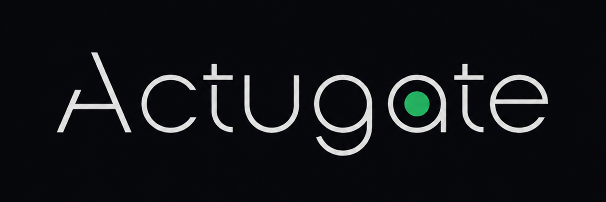

    

## Что будет в [блоге](https://xlebore3o4ka.github.io/ActugateBlog)?

Я планирую выкладывать как процесс разработки и новости, так и **идеи**.
По большей части я делаю это для себя и сомневаюсь что кто-то наткнется на этот блог.
А если такое и случится, со мной всегда можно связаться в дискорде: `@xlebore3o4ka`.

Я планирую выкладывать и гифки, и внутренности игры. Для меня это важно, что бы не забросить,
а так же иметь память об игре в цифровом виде.

> Да, если кто-то не понял игры сейчас тупо нет, даже беты. Даже альфы...

Разрабатываю я игру один и планирую сделать ее полностью бесплатной...

Наверное...
