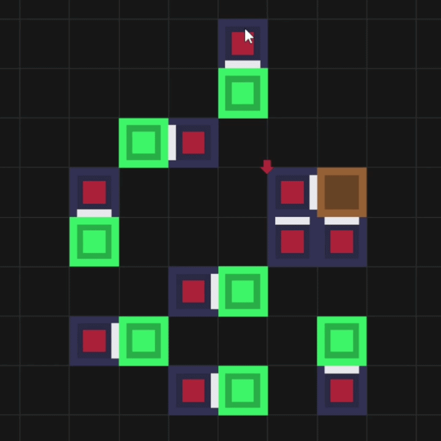

### Я считаю блог должен начаться с демонстрации

> На этой демо-гифке изображен простой механизм нелинейного перемещения коробки.
> Можно увидеть как липкие поршни толкают активаторы, которые активируют другие поршни и так далее... В конце концов коробка не просто двигается вперед, но еще и вбок!

Хотелось бы разобрать все по отдельности, например видите ли красную стрелочку над одним из поршней? Это приоритет по которому поршни определяют кто из них активируется при конфликте. А стержни - это не визуальный эффект, а отдельный тип клетки.

Подробнее о всех механиках можно узнать [здесь](https://xlebore3o4ka.itch.io/actugate) и [тут](https://telegra.ph/Actugate-06-09) на русском.

---

### Но не обманывайтесь картинкой.

То что вы видели на гифке это раннее, очень сырое начало. Да там есть анимации, да оно работает без багов, но реализовано оно... очень слабо.

---

## С чего все началось?

Забавно, но с [этого](https://www.youtube.com/watch?v=RL1SOiTODgA) видео на ютубе. Мне **так сильно** понравилась механика, что я захотел сделать что-то похожее, абстрагируясь от трех-мерного пространства.

Прототип был написан на `python`, а в качестве графического движка использовался `py-raylib-cffi`.

Сегодня же я пишу прототип на `Nim`, а отрисовываю все тем же `raylib`. Честно говоря, благодаря этому проекту я и встретил сей прекрасный язык `Nim` и планирую полностью перейти на него.

---

    

## Что будет в блоге?

Здесь же я планирую выкладывать как процесс разработки и новости, так и **идеи**. По большей части я делаю это для себя и сомневаюсь что кто-то наткнется на этот блог. А если такое и случится, со мной всегда можно связаться в дискорде: `@xlebore3o4ka`.

Я планирую выкладывать и гифки, и внутренности игры. Для меня это важно, что бы не забросить, а так же иметь память об игре в цифровом виде.

> Да, если кто-то не понял игры сейчас тупо нет, даже беты. Даже альфы...

Разрабатываю я игру один и планирую сделать ее полностью бесплатной...

Наверное...

---

## TODO на сегодня:
- определиться с сигнатурой планов
- реализовать минимальный алгоритм сбора планов
- залить блог на github pages
- попить чаю
- 🤗