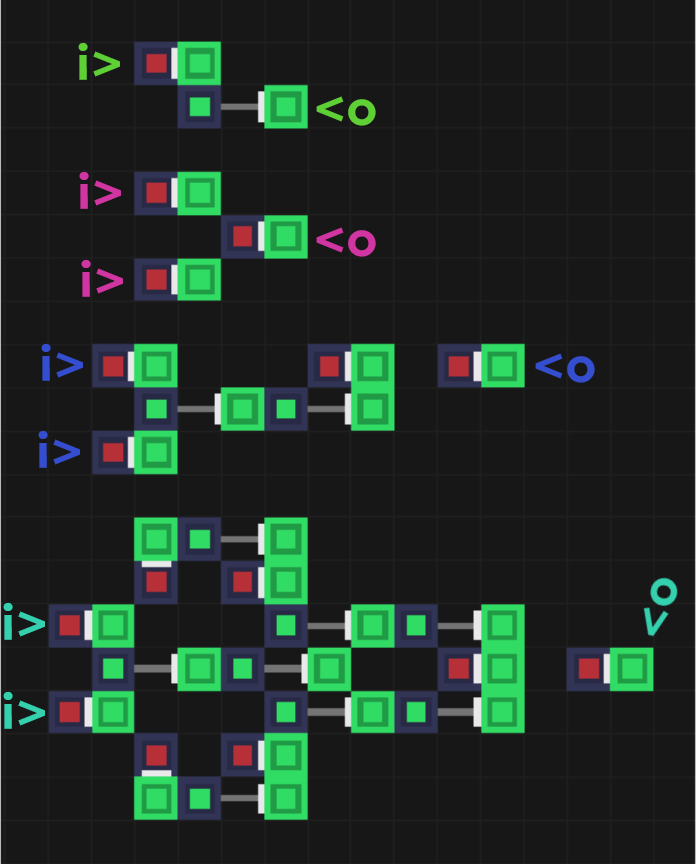

## Напомню что проект находится на ранней стадии разработки

Сейчас у меня есть минимально готовая демо-версия игры на `python`. В ней есть несколько багов отрисовки и управления, но логика идеальна.

Эту версию часто можно будет увидеть в блоге. Что касается прототипа на `Nim`...

##### Он готов на 2%

> Все что я пока продумал это расположения файлов, структуру данных и их хранение

Да, у меня нет даже логики обработки данных, только хранение.

---

Если подробнее, готовы `spatial.nim`, `cell.nim` и частично готов `core.nim`

- `spatial.nim` содержит пространственные данные клеток, позиция, направление и их взаимоотношения.
- `cell.nim` содержит описание пока что всего 3 из 5 готовящихся клеток.
- `core.nim` содержит мир, таблицу клеток и пару методов взаимодействия.

> Да, `core.nim` на самом деле вообще не готов.

---

### А вот что касается блога

Я сильно постарался над сайтом, посты компонуются в `index.html` из своих собственных директорий. Это очень удобно, я пишу markdown файлы и они появляются на сайте!

Я так же добавил теги, краткое описание к каждому посту и адаптивность под мобильные устройства! Анимации тоже есть, хоть и примитивные.

---

Блог уже на `github pages`, сегодня планирую доделать алгоритм сбора планов, но времени, конечно, не хватает. Я стараюсь как можно больше уделять его игре, но и не забываю про личную жизнь!

> Чай поставьте🤗

---

## Вернемся к Actugate

Ниже представлены несколько схем, доступные к постройке в демо-версии:

Это не космические корабли, а 4 логических вентиля: `not`, `or`, `and` и `xor`. Буквами `i>` и `<o` отмечены входы и выходы. Каждый цвет обозначений относится к своему вентилю.

> Букв нет в игре* Я добавил их в редакторе изображений.

Я бы предложил построить их в игре самостоятельно и проверить как они работают, но увы, игры ни у кого нет🤗

---

## Управление демо-версии

Очень скудное:

- Класть в кисть одну из 4 клеток
- Пипетка по клетке для копирования в кисть
- Пипеткой по воздуху - очистить кисть
- Пустой кистью по поршню - ручная активация
- Перемещение камеры перетаскиванием
- Приближение и уменьшение обзора камеры

Никакого меню, никаких подсказок. Эта демо скорее для меня, чем для людей, по этому я ее и не собираюсь выпускать.

---

### А вот что я планирую...

**Начать выкладываться на ютуб!** Хочу что бы кто-нибудь заинтересовался игрой, стал следить за блогом, давал мне идеи...

Ну а до той поры, буду выкладывать посты в блог о том как идет разработка! До связи.