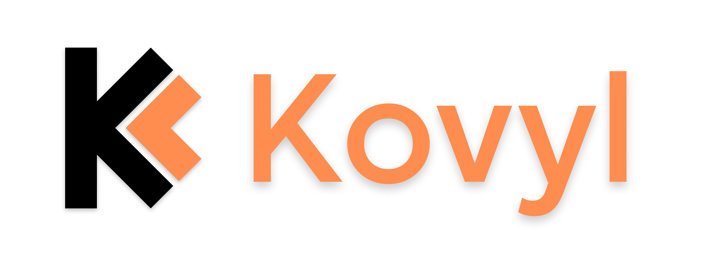

# Я взял небольшой перерыв

За раз было реализовано несколько мощных вещей. Я нашел себе хобби, отличное от Actugate. Считаю это полезно и уменьшит шанс прокрастенации на фоне усталости от монотонной работы над ядром и бытия тимлида.

В этом посте:

- **Графический движок** - скорость разработки медведя
- **Горячие сливы** - графического движка и структуры проекта
- **Система тестов** - на сколько легко их стало писать
- **Подробнее о хобби** - что это такое?
- Чай🤗

---

# Графический движок

`@medveed` показал текущее состояние движка. Реализовано примитивное отображение клеток и их состояния. Плавное перемещение и изменение масштаба камеры.


Управление из окна пока не реализовано, так что быстрое тестирование по прежнему происходит в консоли.

---

# Структура проекта

Она увеличилась с последнего показа:

```
Actugate
|-- build
|-- src
|   |-- core
|   |   |-- core.nim
|   |   `-- utils.nim
|   |-- data
|   |   |-- cells.nim
|   |   |-- plans.nim
|   |   `-- spatial.nim
|   |-- render
|   |   |-- camera.nim
|   |   |-- colors.nim
|   |   |-- coords.nim
|   |   |-- draw.nim
|   |   |-- grid.nim
|   |   |-- renderer.nim
|   |   |-- types.nim
|   |   `-- utils.nim
|   `-- actugate.nim
|-- tests
|   |-- cells_stay.nim
|   |-- piston_activated_cross.nim
|   `-- piston_activates_dif_dirs.nim
`-- actugate.nimble
```

`core` и `data` - заслуга моя, `@xlebore3o4ka`. Кажется что я сделал немного, но в этих 5 файлах содержится достаточно оптимизированное ядро всей игры.

За `render` спасибо `@medveed`, он делает отличную, чистую работу, но на этом все еще не кончено...

---

# Тесты

В TUI я создал невероятно удобную команду, позволяющая собирать большой файл теста используя пару игровых сохранений. 

`S name` - команда, позволяющая создать сохранение. Она запоминает весь мир и тик, на котором это сохранение было совершенно.

`T name init t1 t2 t3` - та самая **волшебная** команда. Она собирает из нескольких сохранений тест. В файле теста автоматически появляется загрузка мира и проверки на требуемое состояние. Все что требуется от меня это задать эти состояния.

Пока тестов всего 3, но их потребуется примерно в 10 раз больше, что бы ничего не сломать🤗

### Забавный баг

И без багов не обходится! Тесты показали что флаг `keep` (который позволяет клетке оставаться на месте) сбрасывался **некорректно** и благодаря тестам этот баг был исправлен!

---

# Хобби

Думать каждый день о механике, решать баги и конструировать сложную систему часто ведет к моральной усталости и прокрастенации...

### По этому я решил параллельно создавать свой язык программирования!

Знакомьтесь, это Kovyl:



Я добавил два новых тега для потов: `Kovyl` и `Actugate` и блог разделится на разработку того и другово!

---

# Итог

К готовности проекта можно накинуть 1% за графику, но пока до релиза далеко😅

На этом пока все. Осталось только чаю попить ну и ладно🤗
